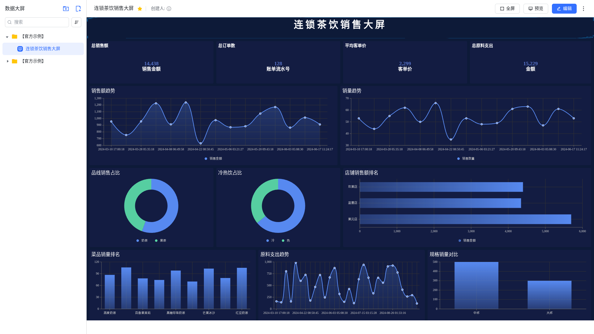

<p align="center"><a href="#"></a></p>
<h3 align="center">人人可用的开源 BI 工具</h3>
<p align="center">
  <a href="https://www.gnu.org/licenses/gpl-3.0.html"></a>
</p>
<p align="center">
  <a href="/README.md"></a>
  <a href="/docs/README.en.md"></a>
  <a href="/docs/README.zh-Hant.md"></a>
  <a href="/docs/README.ja.md"></a>
  <a href="/docs/README.pt-br.md"></a>
  <a href="/docs/README.ar.md"></a>
  <a href="/docs/README.de.md"></a>
  <a href="/docs/README.es.md"></a>
  <a href="/docs/README.fr.md"></a>
  <a href="/docs/README.ko.md"></a>
  <a href="/docs/README.id.md"></a>
  <a href="/docs/README.tr.md"></a>
</p>

------------------------------

## 什么是 PyDataEase？

PyDataEase 是开源的 BI 工具，帮助用户快速分析数据并洞察业务趋势，从而实现业务的改进与优化。PyDataEase 支持丰富的数据源连接，能够通过拖拉拽方式快速制作图表，并可以方便的与他人分享。

**PyDataEase 的优势：**

-   开源开放：零门槛，线上快速获取和安装，按月迭代；
-   简单易用：极易上手，通过鼠标点击和拖拽即可完成分析；
-   全场景支持：多平台安装和多样化嵌入支持；
-   安全分享：支持多种数据分享方式，确保数据安全。

**PyDataEase 支持的数据源：**

-   OLTP 数据库： MySQL、Oracle、SQL Server、PostgreSQL、MariaDB、Db2、TiDB、MongoDB-BI 等；
-   OLAP 数据库： ClickHouse、Apache Doris、Apache Impala、StarRocks 等；
-   数据仓库/数据湖： Amazon RedShift 等；
-   数据文件： Excel、CSV 等；
-   API 数据源。

## 技术栈

-   前端：[Vue 3](https://vuejs.org/)、[Element Plus](https://element-plus.org/)
-   图库：[AntV](https://antv.vision/zh)
-   后端：[FastAPI](https://fastapi.tiangolo.com/)（SQLAlchemy 2.x async、Alembic、Pydantic v2）
-   数据库：[PostgreSQL 16](https://www.postgresql.org/)
-   数据处理：[Apache SeaTunnel](https://github.com/apache/seatunnel)（规划中）
-   基础设施：[Docker](https://www.docker.com/)

## 快速开始

### 环境要求

-   Python 3.12+
-   Node.js 18+
-   PostgreSQL 16
-   Docker (可选)

### 后端开发

```bash
cd core/pydataease-backend
cp .env.example .env   # 编辑数据库连接等配置
uv sync                # 安装依赖
uv run alembic upgrade head  # 数据库迁移
uv run uvicorn app.main:app --host 0.0.0.0 --port 8000  # 启动开发服务器
```

### 前端开发

```bash
cd core/core-frontend
npm install
npm run dev            # 启动开发服务器 (http://localhost:8080)
```

### 测试

```bash
# 后端
cd core/pydataease-backend
uv run ruff check .                                          # Lint
uv run pytest tests/ -v --ignore=tests/test_e2e_creation_flow.py  # 测试

# 前端
cd core/core-frontend
npm run lint            # ESLint
npm run ts:check        # TypeScript 类型检查
npm run build:distributed  # 生产构建
```

### Docker 部署

```bash
docker compose -f docker-compose.prod.yml up -d
```

### 默认管理员

默认管理员账号：admin / DataEase@123456

## Demo 数据

项目提供种子脚本，一键生成演示看板和大屏数据，方便快速体验功能。

### 前置条件

1. PostgreSQL 已启动并完成迁移（`uv run alembic upgrade head`）

### 使用方式

```bash
# 从项目根目录执行

# 仅生成 demo 看板（仪表板 + PostgreSQL 数据源 + 数据集）
python3 scripts/seed_demo_data.py

# 仅生成 demo 大屏（连锁茶饮销售大屏，深色主题，13 个组件）
python3 scripts/seed_demo_data.py --screen-only

# 同时生成看板和大屏
python3 scripts/seed_demo_data.py --with-screen
```

脚本幂等，重复执行不会产生重复数据。

### Demo 大屏预览

连锁茶饮销售大屏（1920×1190，深色主题，自动刷新 5 分钟）：

<p align="center">
  
</p>

组件包括：标题横幅（锁定不可拖拽）、4 个 KPI 指标卡、柱状图、折线图、饼图、环形图等。

### 预览地址

启动前后端服务后访问：

- **看板**：`http://localhost:8080/#/panel/proxy?dvId=985192741891870720`
- **大屏**：`http://localhost:8080/#/previewShow?dvId=995100000000000002`

## 项目结构

```
pydataease/
├── core/
│   ├── pydataease-backend/    # Python/FastAPI 后端
│   │   ├── app/
│   │   │   ├── routers/       # API 路由 (107 端点)
│   │   │   ├── services/      # 业务逻辑
│   │   │   ├── repositories/  # 数据访问层
│   │   │   ├── models/        # SQLAlchemy 模型
│   │   │   └── schemas/       # Pydantic schemas
│   │   ├── alembic/           # 数据库迁移
│   │   └── tests/             # 1,138+ 测试
│   └── core-frontend/         # Vue 3 前端
│       └── src/
├── docker-compose.prod.yml    # 生产部署
└── Dockerfile                 # 多阶段构建
```

## License

Copyright (c) 2024-2026 JasonGu, All rights reserved.

Licensed under The GNU General Public License version 3 (GPLv3)  (the "License"); you may not use this file except in compliance with the License. You may obtain a copy of the License at

<https://www.gnu.org/licenses/gpl-3.0.html>

Unless required by applicable law or agreed to in writing, software distributed under the License is distributed on an "AS IS" BASIS, WITHOUT WARRANTIES OR CONDITIONS OF ANY KIND, either express or implied. See the License for the specific language governing permissions and limitations under the License.
